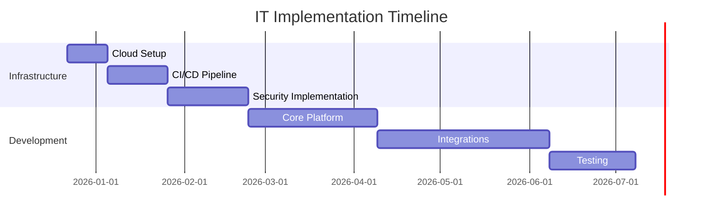
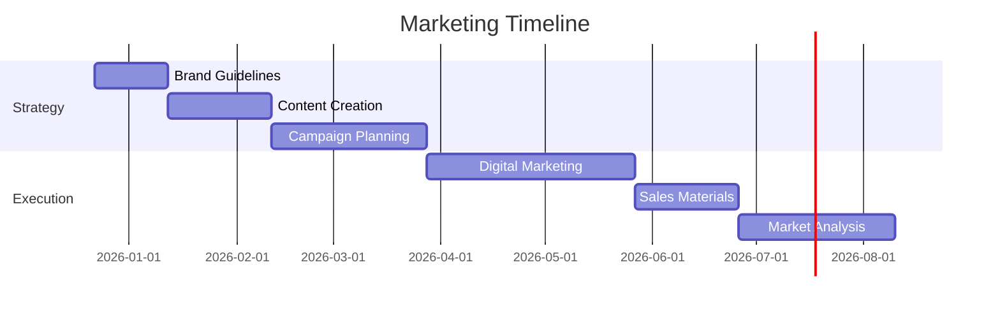
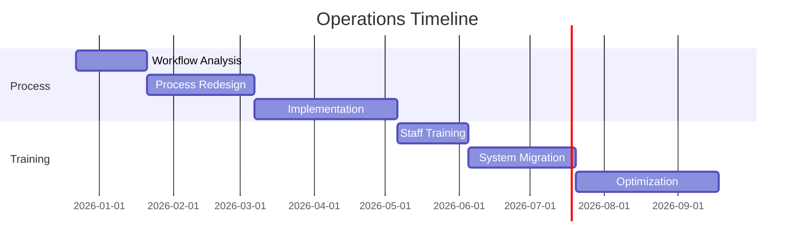
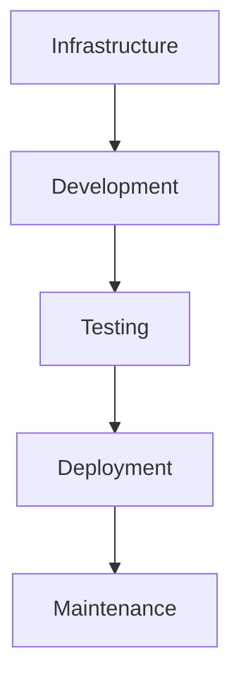
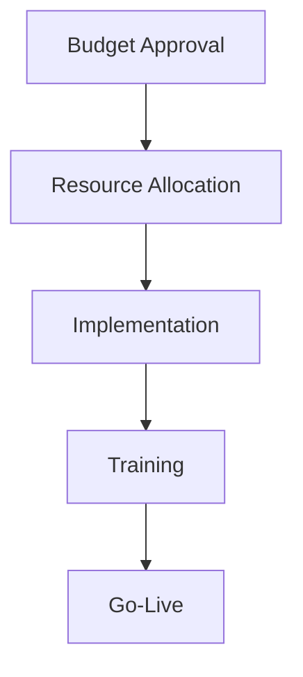
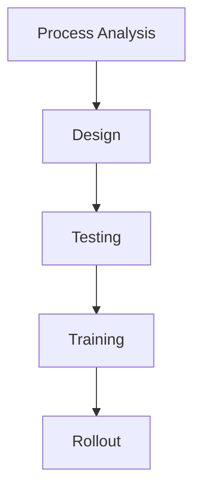

# Action Items & Task List

## Immediate Actions (Next 2 Weeks)

### Technical Setup
- [ ] Complete cloud infrastructure setup
- [ ] Configure development environments
- [ ] Set up CI/CD pipelines
- [ ] Implement monitoring systems
- [ ] Configure security baselines

### Business Preparation
- [ ] Finalize budget allocation
- [ ] Form project teams
- [ ] Assign responsibilities
- [ ] Create communication plan
- [ ] Schedule kickoff meetings

### Documentation
- [ ] Technical architecture docs
- [ ] API specifications
- [ ] Security protocols
- [ ] Data flow diagrams
- [ ] Integration maps

## Short-Term Actions (2-4 Weeks)

### Development
- [ ] Start core platform development
- [ ] Begin user authentication system
- [ ] Implement multi-language support
- [ ] Create product catalog structure
- [ ] Build basic order system

### Business Process
- [ ] Map current workflows
- [ ] Identify optimization points
- [ ] Design new processes
- [ ] Create training materials
- [ ] Plan change management

### Marketing
- [ ] Develop communication strategy
- [ ] Create marketing materials
- [ ] Plan launch campaign
- [ ] Prepare sales materials
- [ ] Design brand guidelines

## Medium-Term Actions (1-3 Months)

### Integration
- [ ] Begin ERP integration
- [ ] Start CRM integration
- [ ] Connect inventory systems
- [ ] Link accounting systems
- [ ] Test data flows

### Training
- [ ] Train IT staff
- [ ] Prepare user guides
- [ ] Conduct sales training
- [ ] Support team training
- [ ] Partner onboarding

### Testing
- [ ] Unit testing
- [ ] Integration testing
- [ ] Performance testing
- [ ] Security testing
- [ ] User acceptance testing

## Long-Term Actions (3-6 Months)

### Platform Evolution
- [ ] Implement advanced features
- [ ] Add AI capabilities
- [ ] Enable IoT integration
- [ ] Enhance analytics
- [ ] Optimize performance

### Market Expansion
- [ ] Enter new markets
- [ ] Add product lines
- [ ] Expand services
- [ ] Grow partner network
- [ ] Increase market share

### Innovation
- [ ] Research new technologies
- [ ] Pilot new features
- [ ] Test market response
- [ ] Gather feedback
- [ ] Iterate improvements

## Ongoing Tasks

### Monitoring
- [ ] System performance
- [ ] User adoption
- [ ] Market response
- [ ] Competition analysis
- [ ] Risk assessment

### Optimization
- [ ] Process efficiency
- [ ] Resource utilization
- [ ] Cost management
- [ ] Quality control
- [ ] Customer satisfaction

### Maintenance
- [ ] System updates
- [ ] Security patches
- [ ] Data backups
- [ ] Documentation updates
- [ ] Training refreshers

## Department-Specific Tasks

### IT Department

### Marketing Department

### Operations Department

## Critical Dependencies

### Technical Dependencies

### Business Dependencies

### Process Dependencies

## Risk Mitigation Tasks

### Security
- [ ] Regular security audits
- [ ] Penetration testing
- [ ] Compliance checks
- [ ] Access reviews
- [ ] Incident response planning

### Business Continuity
- [ ] Backup procedures
- [ ] Disaster recovery
- [ ] Failover testing
- [ ] Documentation
- [ ] Emergency contacts

### Quality Assurance
- [ ] Code reviews
- [ ] Performance testing
- [ ] User testing
- [ ] Documentation review
- [ ] Process validation

## Success Metrics Tracking

### Technical Metrics
- [ ] System uptime
- [ ] Response times
- [ ] Error rates
- [ ] Security incidents
- [ ] Integration status

### Business Metrics
- [ ] Revenue growth
- [ ] Cost reduction
- [ ] User adoption
- [ ] Customer satisfaction
- [ ] Market share

### Operational Metrics
- [ ] Process efficiency
- [ ] Resource utilization
- [ ] Training completion
- [ ] Support tickets
- [ ] Resolution times
