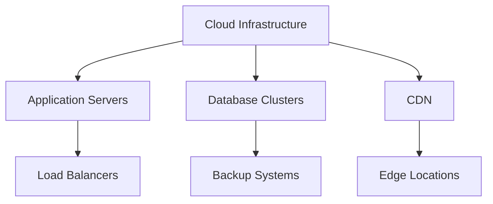
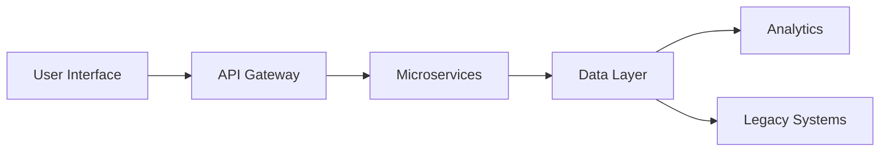
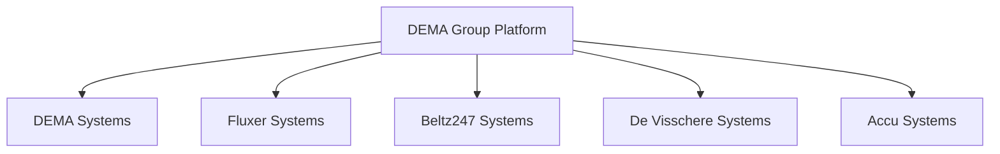

# Technical Roadmap

## Phase 1: Foundation (Months 1-6)

### 1. Infrastructure Setup
- [x] Cloud architecture design
- [x] Development environment setup
- [x] CI/CD pipeline implementation
- [ ] Monitoring and logging systems
- [ ] Disaster recovery planning

### 2. Core Platform Development
- [x] Authentication system
- [x] Multi-language support
- [x] User role management
- [ ] Product catalog structure
- [ ] Order management system

### 3. Data Migration
- [ ] Data schema standardization
- [ ] Legacy system analysis
- [ ] Migration tools development
- [ ] Test migration runs
- [ ] Data validation procedures

### 4. Security Implementation
- [x] Access control system
- [x] Data encryption
- [x] Audit logging
- [ ] Security monitoring
- [ ] Penetration testing

## Phase 2: Integration (Months 6-12)

### 1. Company Systems Integration
- [ ] ERP integration
- [ ] CRM integration
- [ ] Inventory management
- [ ] Supplier portal
- [ ] Partner portal

### 2. E-commerce Features
- [ ] Shopping cart
- [ ] Payment processing
- [ ] Order tracking
- [ ] Invoicing system
- [ ] Returns management

### 3. Customer Features
- [ ] Account management
- [ ] Order history
- [ ] Saved preferences
- [ ] Quote management
- [ ] Credit system

### 4. Analytics Implementation
- [ ] Business intelligence setup
- [ ] Custom reporting
- [ ] KPI dashboards
- [ ] Predictive analytics
- [ ] A/B testing framework

## Phase 3: Optimization (Months 12-18)

### 1. Process Automation
- [ ] Order processing
- [ ] Inventory updates
- [ ] Price management
- [ ] Document generation
- [ ] Customer communications

### 2. Advanced Features
- [ ] Product configurator
- [ ] Virtual product tours
- [ ] AR product visualization
- [ ] Bulk order tools
- [ ] Integration APIs

### 3. Performance Optimization
- [ ] Load balancing
- [ ] Caching strategy
- [ ] Database optimization
- [ ] CDN implementation
- [ ] Mobile optimization

### 4. Support Systems
- [ ] Knowledge base
- [ ] Chatbot integration
- [ ] Ticket system
- [ ] Video tutorials
- [ ] Support dashboard

## Phase 4: Innovation (Months 18-24)

### 1. AI/ML Implementation
- [ ] Product recommendations
- [ ] Demand forecasting
- [ ] Price optimization
- [ ] Fraud detection
- [ ] Customer segmentation

### 2. IoT Integration
- [ ] Sensor data collection
- [ ] Predictive maintenance
- [ ] Real-time monitoring
- [ ] Remote diagnostics
- [ ] Asset tracking

### 3. Advanced Analytics
- [ ] Customer behavior analysis
- [ ] Supply chain optimization
- [ ] Market trend analysis
- [ ] Competitive analysis
- [ ] ROI tracking

### 4. Platform Evolution
- [ ] Microservices architecture
- [ ] Event-driven systems
- [ ] GraphQL API
- [ ] PWA implementation
- [ ] Edge computing

## Technical Dependencies

### Infrastructure

### Data Flow

### Integration Points

## Technology Stack

### Frontend
- Next.js
- React
- TypeScript
- TailwindCSS
- Redux/Zustand

### Backend
- Node.js
- Express
- PostgreSQL
- Redis
- RabbitMQ

### DevOps
- Docker
- Kubernetes
- GitHub Actions
- Terraform
- Prometheus/Grafana

### Security
- OAuth 2.0
- JWT
- SSL/TLS
- WAF
- DDoS Protection
