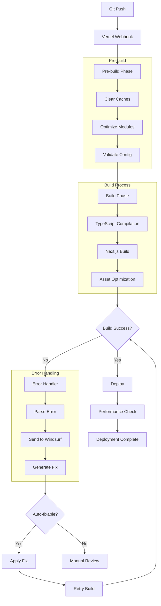
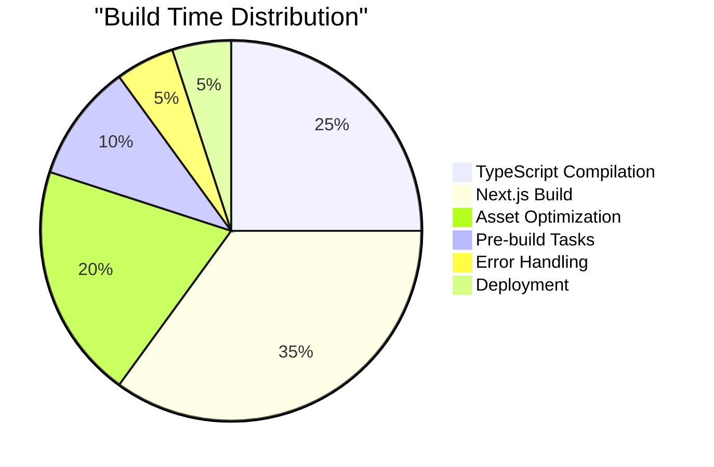
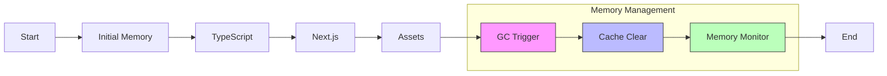
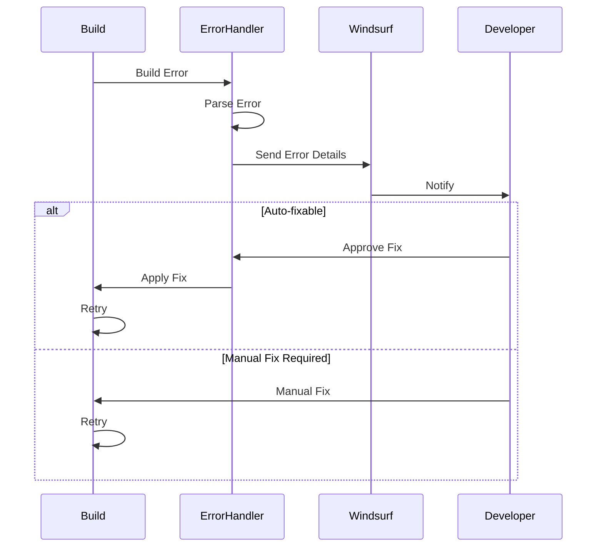
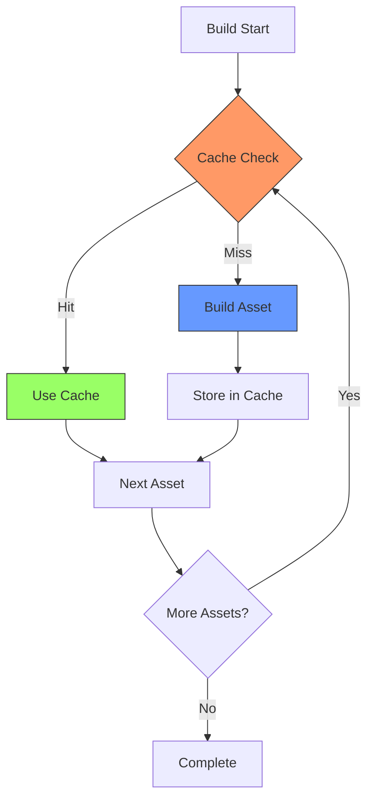

# Build Flow Diagram

# Build Time Breakdown

# Memory Usage Flow

# Error Resolution Flow

# Cache Strategy

These diagrams provide a visual guide to:
1. Overall build flow
2. Time distribution
3. Memory management
4. Error handling
5. Cache strategy

Each diagram is interactive in GitHub and can be updated as our build process evolves.
