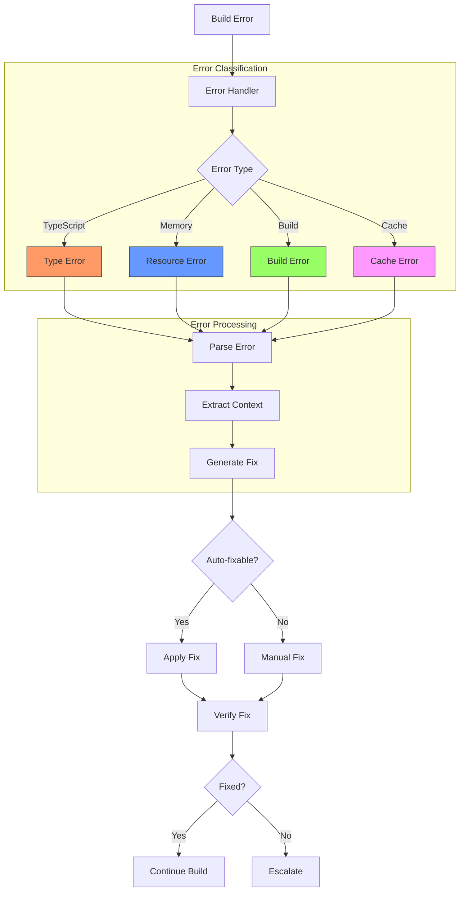
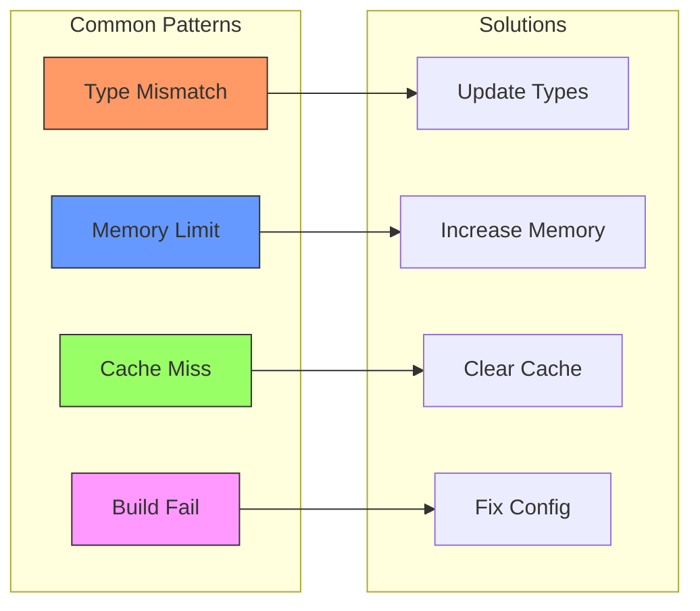
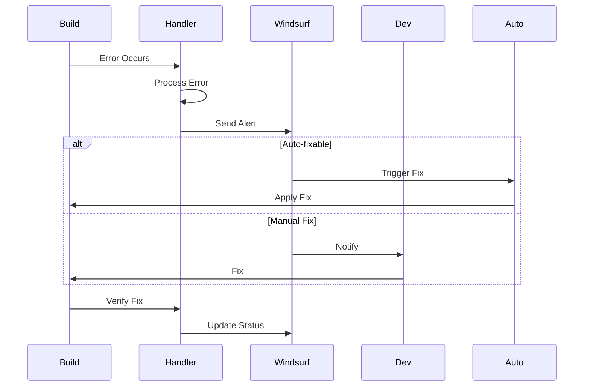
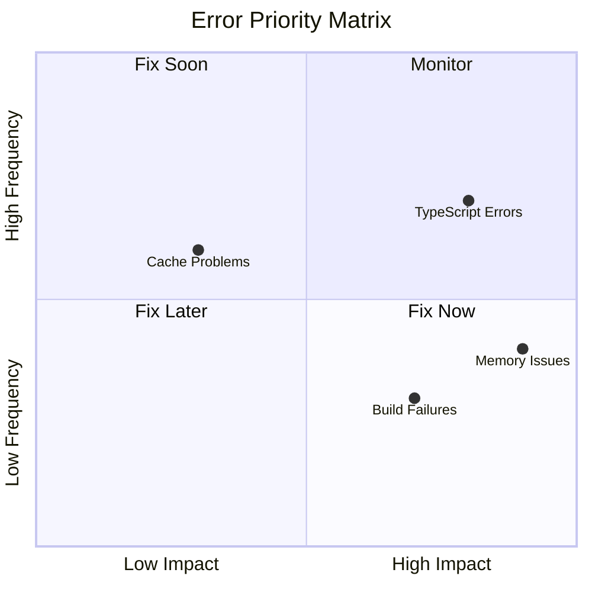

# Error Handling Flow



# Error Resolution Timeline

```mermaid
gantt
    title Error Resolution Process
    dateFormat  s
    axisFormat %M:%S
    
    section TypeScript
    Detect    :0, 5s
    Parse     :5s, 10s
    Fix       :10s, 30s
    Verify    :30s, 40s
    
    section Memory
    Monitor   :0, 60s
    Alert     :60s, 65s
    Optimize  :65s, 90s
    
    section Build
    Attempt   :0, 120s
    Error     :120s, 125s
    Resolve   :125s, 180s
```

# Error Pattern Analysis



# Error Notification Flow



# Error Priority Matrix



These diagrams help visualize:
1. Error handling flow
2. Resolution timeline
3. Common patterns
4. Notification system
5. Priority matrix

Each error type has a clear path to resolution with defined responsibilities.
