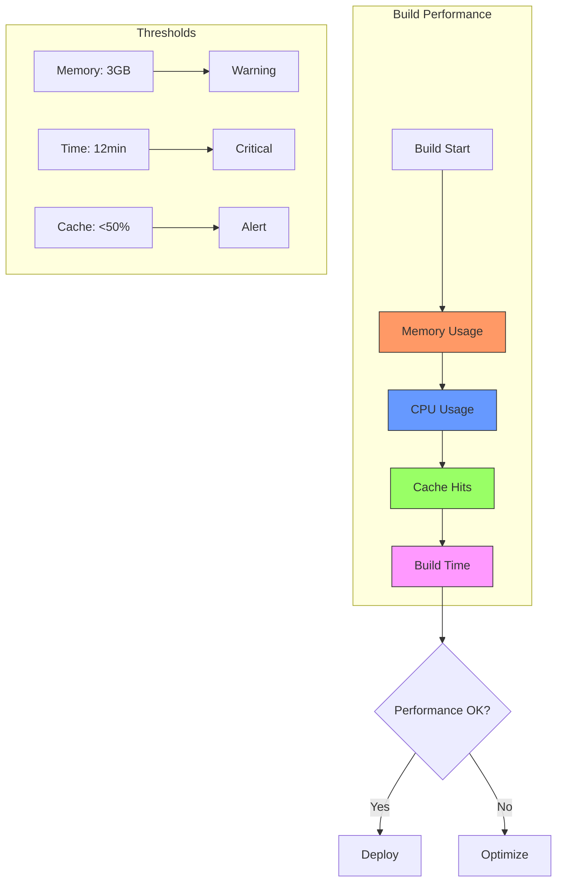
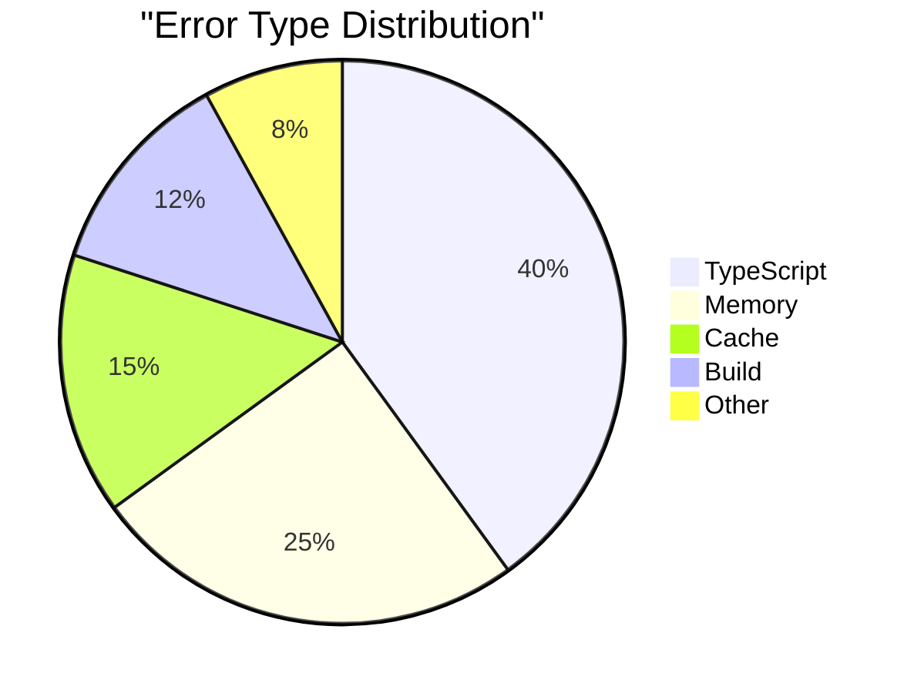
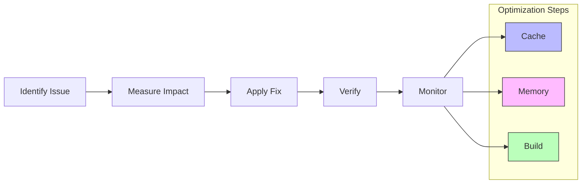
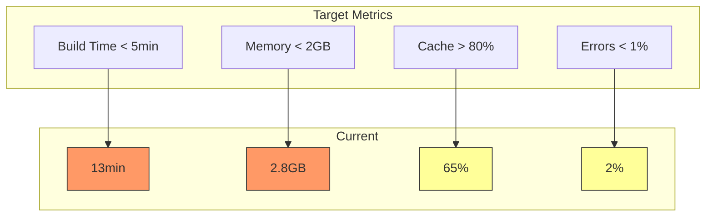

# Performance Metrics Visualization



# Resource Usage Over Time

```mermaid
gantt
    title Build Resource Usage
    dateFormat  s
    axisFormat %M:%S
    
    section Memory
    Initialization    :0, 30s
    TS Compilation   :30s, 120s
    Next.js Build    :120s, 360s
    Asset Optimization :360s, 480s
    
    section CPU
    Low Usage     :0, 60s
    High Usage    :60s, 300s
    Medium Usage  :300s, 480s
    
    section Cache
    Check Cache   :0, 10s
    Cache Hits    :10s, 200s
    Cache Misses  :200s, 250s
    Store Cache   :250s, 300s
```

# Error Distribution



# Performance Improvement Flow



# Success Metrics



These visualizations help track:
1. Resource usage patterns
2. Performance bottlenecks
3. Error distributions
4. Optimization targets
5. Success metrics

The diagrams update with each build to show trends and patterns.
