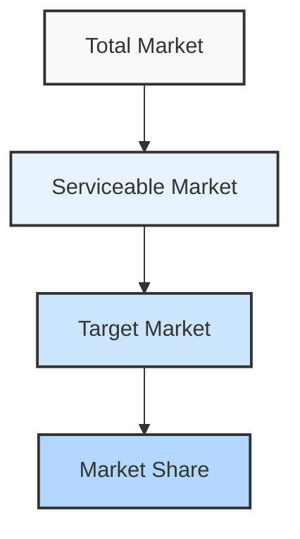
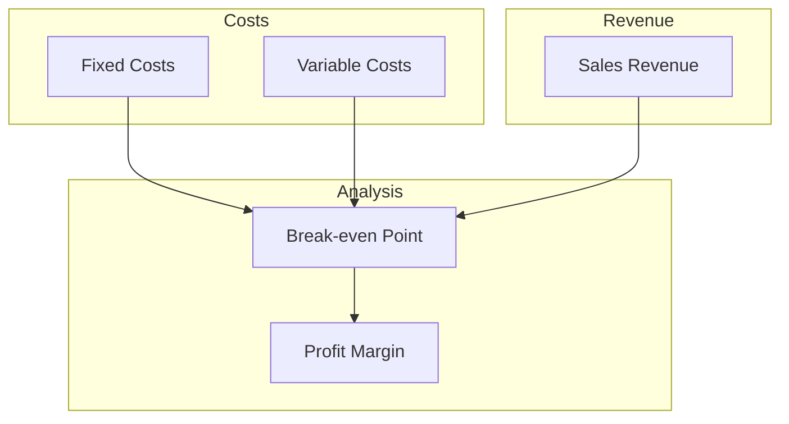

# Financial Model & Projections

## Investment Requirements

### Technology Investment
```typescript
interface TechnologyInvestment {
  category: string;
  items: Array<{
    name: string;
    cost: number;
    type: 'capex' | 'opex';
    year: number;
  }>;
}

const technologyInvestments: TechnologyInvestment[] = [
  {
    category: 'Infrastructure',
    items: [
      { name: 'Cloud Infrastructure', cost: 250000, type: 'opex', year: 1 },
      { name: 'Development Tools', cost: 100000, type: 'capex', year: 1 },
      { name: 'Security Systems', cost: 150000, type: 'capex', year: 1 }
    ]
  },
  {
    category: 'Software Development',
    items: [
      { name: 'Core Platform', cost: 400000, type: 'capex', year: 1 },
      { name: 'Integration Services', cost: 200000, type: 'capex', year: 1 },
      { name: 'Custom Features', cost: 100000, type: 'capex', year: 2 }
    ]
  }
];
```

### Operational Costs
```typescript
interface OperationalCost {
  category: string;
  monthly: number;
  annual: number;
  growth: number; // yearly growth rate
}

const operationalCosts: OperationalCost[] = [
  {
    category: 'Cloud Services',
    monthly: 20000,
    annual: 240000,
    growth: 0.1
  },
  {
    category: 'Support Staff',
    monthly: 25000,
    annual: 300000,
    growth: 0.05
  },
  {
    category: 'Maintenance',
    monthly: 15000,
    annual: 180000,
    growth: 0.03
  }
];
```

## Revenue Projections

### Revenue Streams
```typescript
interface RevenueStream {
  source: string;
  model: 'subscription' | 'transaction' | 'service';
  projections: Array<{
    year: number;
    amount: number;
    growth: number;
  }>;
}

const revenueStreams: RevenueStream[] = [
  {
    source: 'Platform Subscriptions',
    model: 'subscription',
    projections: [
      { year: 1, amount: 500000, growth: 0.4 },
      { year: 2, amount: 700000, growth: 0.3 },
      { year: 3, amount: 910000, growth: 0.2 }
    ]
  },
  {
    source: 'Transaction Fees',
    model: 'transaction',
    projections: [
      { year: 1, amount: 300000, growth: 0.5 },
      { year: 2, amount: 450000, growth: 0.4 },
      { year: 3, amount: 630000, growth: 0.3 }
    ]
  }
];
```

### Market Growth


## ROI Analysis

### Key Metrics
```typescript
interface ROIMetrics {
  metric: string;
  value: number;
  unit: string;
  description: string;
}

const roiMetrics: ROIMetrics[] = [
  {
    metric: 'NPV',
    value: 1500000,
    unit: 'EUR',
    description: 'Net Present Value over 5 years'
  },
  {
    metric: 'IRR',
    value: 25,
    unit: '%',
    description: 'Internal Rate of Return'
  },
  {
    metric: 'Payback Period',
    value: 2.5,
    unit: 'years',
    description: 'Time to recover investment'
  }
];
```

### Cost Savings
```typescript
interface CostSaving {
  category: string;
  current: number;
  projected: number;
  savings: number;
  timeline: string;
}

const costSavings: CostSaving[] = [
  {
    category: 'Operational Efficiency',
    current: 1000000,
    projected: 800000,
    savings: 200000,
    timeline: 'Year 1'
  },
  {
    category: 'Manual Processing',
    current: 500000,
    projected: 300000,
    savings: 200000,
    timeline: 'Year 2'
  }
];
```

## Financial Forecasts

### 5-Year Projection
```typescript
interface FinancialProjection {
  year: number;
  revenue: number;
  costs: number;
  profit: number;
  margin: number;
}

const financialProjections: FinancialProjection[] = [
  {
    year: 1,
    revenue: 1000000,
    costs: 900000,
    profit: 100000,
    margin: 0.1
  },
  {
    year: 2,
    revenue: 1500000,
    costs: 1200000,
    profit: 300000,
    margin: 0.2
  },
  {
    year: 3,
    revenue: 2250000,
    costs: 1600000,
    profit: 650000,
    margin: 0.29
  }
];
```

### Break-even Analysis


## Investment Timeline

### Funding Phases
```typescript
interface FundingPhase {
  phase: string;
  amount: number;
  source: string;
  timing: string;
  milestones: string[];
}

const fundingPhases: FundingPhase[] = [
  {
    phase: 'Initial Investment',
    amount: 1000000,
    source: 'Internal',
    timing: 'Q1 2026',
    milestones: [
      'Infrastructure setup',
      'Core development',
      'Initial integrations'
    ]
  },
  {
    phase: 'Second Round',
    amount: 800000,
    source: 'Internal',
    timing: 'Q3 2026',
    milestones: [
      'Feature expansion',
      'Market rollout',
      'Scale operations'
    ]
  }
];
```

### Capital Allocation
```typescript
interface CapitalAllocation {
  category: string;
  percentage: number;
  amount: number;
  priority: 'high' | 'medium' | 'low';
}

const capitalAllocation: CapitalAllocation[] = [
  {
    category: 'Technology',
    percentage: 45,
    amount: 810000,
    priority: 'high'
  },
  {
    category: 'Operations',
    percentage: 25,
    amount: 450000,
    priority: 'high'
  },
  {
    category: 'Marketing',
    percentage: 20,
    amount: 360000,
    priority: 'medium'
  },
  {
    category: 'Contingency',
    percentage: 10,
    amount: 180000,
    priority: 'low'
  }
];
```
