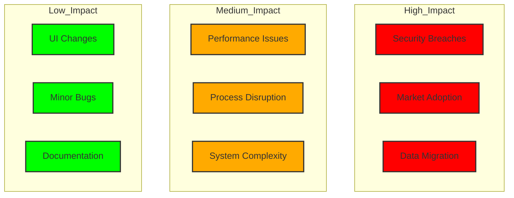
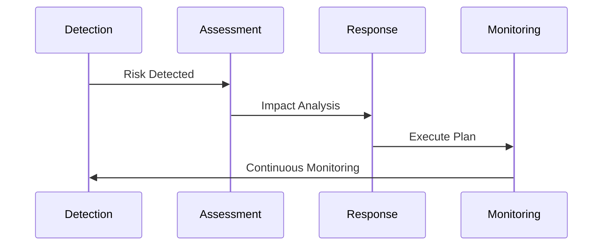

# Risk Assessment Matrix

## Risk Categories

### Technical Risks

| Risk | Probability | Impact | Mitigation |
|------|------------|--------|------------|
| Data Migration Failure | Medium | High | - Comprehensive testing\n- Backup strategy\n- Rollback plan |
| System Integration Issues | High | High | - POC development\n- Phased rollout\n- Fallback options |
| Performance Bottlenecks | Medium | Medium | - Load testing\n- Performance monitoring\n- Scalability planning |
| Security Breaches | Low | Critical | - Security audits\n- Penetration testing\n- Regular updates |
| Infrastructure Downtime | Low | High | - High availability setup\n- DR planning\n- Multi-region deployment |

### Business Risks

| Risk | Probability | Impact | Mitigation |
|------|------------|--------|------------|
| Market Adoption | Medium | Critical | - User research\n- Beta testing\n- Feedback loops |
| Competition Response | High | Medium | - Market monitoring\n- USP development\n- Quick iterations |
| Resource Availability | Medium | High | - Skill matrix\n- Training program\n- Partner network |
| Budget Overrun | Medium | High | - Cost tracking\n- Phase gates\n- Contingency fund |
| Regulatory Changes | Low | High | - Compliance monitoring\n- Legal consultation\n- Adaptable architecture |

### Operational Risks

| Risk | Probability | Impact | Mitigation |
|------|------------|--------|------------|
| Process Disruption | High | Medium | - Change management\n- Training program\n- Phased rollout |
| Data Quality Issues | High | High | - Data validation\n- Cleansing tools\n- Quality gates |
| User Resistance | Medium | High | - User involvement\n- Training program\n- Support system |
| System Complexity | High | Medium | - Documentation\n- Knowledge sharing\n- Modular design |
| Vendor Dependencies | Medium | Medium | - Vendor assessment\n- Contract review\n- Alternative options |

## Risk Heat Map



## Risk Response Strategy

### Prevention Measures
1. **Technical**
   - Comprehensive testing strategy
   - Security-first development
   - Performance monitoring
   - Automated quality checks

2. **Business**
   - Market research
   - Competitor analysis
   - Resource planning
   - Budget tracking

3. **Operational**
   - Process documentation
   - Training programs
   - Support systems
   - Change management

### Mitigation Plans

#### Critical Risks


#### High Impact Risks
1. **Security Breach**
   ```typescript
   interface IncidentResponse {
     severity: 'critical' | 'high' | 'medium' | 'low';
     type: 'security' | 'performance' | 'data';
     actions: string[];
     team: string[];
     timeline: number; // hours
   }

   const securityResponse: IncidentResponse = {
     severity: 'critical',
     type: 'security',
     actions: [
       'Isolate affected systems',
       'Assess breach scope',
       'Notify stakeholders',
       'Execute recovery plan'
     ],
     team: [
       'Security Lead',
       'System Admin',
       'DevOps',
       'Management'
     ],
     timeline: 4
   };
   ```

2. **Data Migration**
   ```typescript
   interface MigrationRollback {
     triggers: string[];
     steps: string[];
     validation: string[];
     timeline: number; // hours
   }

   const migrationRollback: MigrationRollback = {
     triggers: [
       'Data corruption',
       'System failure',
       'Performance degradation'
     ],
     steps: [
       'Stop migration process',
       'Restore from backup',
       'Verify data integrity',
       'Resume operations'
     ],
     validation: [
       'Data checksums',
       'System health',
       'Performance metrics'
     ],
     timeline: 8
   };
   ```

### Monitoring & Review

#### Key Risk Indicators (KRIs)
```typescript
interface RiskIndicator {
  name: string;
  threshold: number;
  current: number;
  trend: 'increasing' | 'stable' | 'decreasing';
  status: 'green' | 'yellow' | 'red';
}

const riskIndicators: RiskIndicator[] = [
  {
    name: 'System Availability',
    threshold: 99.9,
    current: 99.95,
    trend: 'stable',
    status: 'green'
  },
  {
    name: 'Error Rate',
    threshold: 0.1,
    current: 0.05,
    trend: 'decreasing',
    status: 'green'
  },
  {
    name: 'Resource Utilization',
    threshold: 80,
    current: 85,
    trend: 'increasing',
    status: 'yellow'
  }
];
```

#### Review Schedule
```typescript
interface RiskReview {
  frequency: 'daily' | 'weekly' | 'monthly' | 'quarterly';
  participants: string[];
  metrics: string[];
  outputs: string[];
}

const reviewSchedule: RiskReview[] = [
  {
    frequency: 'daily',
    participants: ['Tech Lead', 'DevOps'],
    metrics: ['system health', 'incidents'],
    outputs: ['status report']
  },
  {
    frequency: 'weekly',
    participants: ['Project Lead', 'Tech Lead', 'Business Analyst'],
    metrics: ['KRIs', 'project progress'],
    outputs: ['risk update', 'action items']
  },
  {
    frequency: 'monthly',
    participants: ['Steering Committee'],
    metrics: ['risk matrix', 'mitigation effectiveness'],
    outputs: ['strategic decisions', 'resource allocation']
  }
];
```
