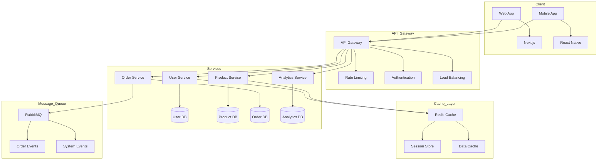
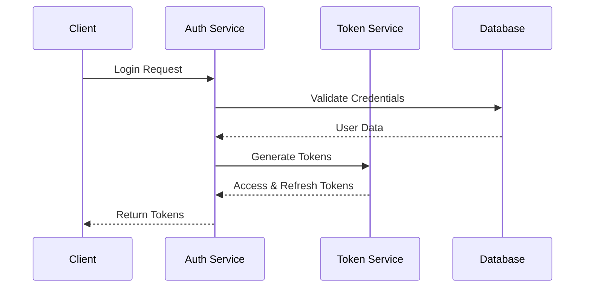

# Technical Architecture Details

## System Architecture



## Infrastructure Components

### Frontend Layer
- **Web Application**
  ```typescript
  // Next.js App Router Structure
  app/
  ├── (auth)/
  │   ├── login/
  │   └── signup/
  ├── (dashboard)/
  │   ├── overview/
  │   ├── orders/
  │   └── analytics/
  ├── (catalog)/
  │   ├── products/
  │   └── categories/
  └── layout.tsx
  ```

- **Component Architecture**
  ```typescript
  // Example Component Structure
  interface ProductCardProps {
    id: string;
    name: string;
    price: number;
    stock: number;
    images: string[];
    specifications: Record<string, string>;
    variants?: ProductVariant[];
  }

  const ProductCard: React.FC<ProductCardProps> = ({
    id,
    name,
    price,
    stock,
    images,
    specifications,
    variants
  }) => {
    // Component implementation
  };
  ```

### API Layer
- **REST Endpoints**
  ```typescript
  // Product Service Routes
  router.get('/products', listProducts);
  router.get('/products/:id', getProduct);
  router.post('/products', createProduct);
  router.put('/products/:id', updateProduct);
  router.delete('/products/:id', deleteProduct);

  // Order Service Routes
  router.post('/orders', createOrder);
  router.get('/orders/:id', getOrder);
  router.put('/orders/:id/status', updateOrderStatus);
  router.get('/orders/user/:userId', getUserOrders);
  ```

- **GraphQL Schema**
  ```graphql
  type Product {
    id: ID!
    name: String!
    description: String
    price: Float!
    stock: Int!
    category: Category!
    specifications: [Specification!]!
    variants: [ProductVariant!]
  }

  type Order {
    id: ID!
    user: User!
    items: [OrderItem!]!
    status: OrderStatus!
    total: Float!
    createdAt: DateTime!
    updatedAt: DateTime!
  }
  ```

### Database Layer
- **Schema Design**
  ```sql
  -- Products Table
  CREATE TABLE products (
    id UUID PRIMARY KEY,
    name VARCHAR(255) NOT NULL,
    description TEXT,
    price DECIMAL(10,2) NOT NULL,
    stock INT NOT NULL,
    category_id UUID REFERENCES categories(id),
    created_at TIMESTAMP DEFAULT CURRENT_TIMESTAMP,
    updated_at TIMESTAMP DEFAULT CURRENT_TIMESTAMP
  );

  -- Orders Table
  CREATE TABLE orders (
    id UUID PRIMARY KEY,
    user_id UUID REFERENCES users(id),
    status VARCHAR(50) NOT NULL,
    total DECIMAL(10,2) NOT NULL,
    created_at TIMESTAMP DEFAULT CURRENT_TIMESTAMP,
    updated_at TIMESTAMP DEFAULT CURRENT_TIMESTAMP
  );
  ```

### Cache Layer
- **Redis Configuration**
  ```typescript
  const redisConfig = {
    host: process.env.REDIS_HOST,
    port: parseInt(process.env.REDIS_PORT || '6379'),
    password: process.env.REDIS_PASSWORD,
    db: 0,
    keyPrefix: 'dema:',
    maxRetriesPerRequest: 3,
    retryStrategy: (times: number) => {
      if (times > 3) return null;
      return Math.min(times * 100, 3000);
    }
  };
  ```

### Message Queue
- **Event Schema**
  ```typescript
  interface OrderCreatedEvent {
    type: 'ORDER_CREATED';
    payload: {
      orderId: string;
      userId: string;
      items: Array<{
        productId: string;
        quantity: number;
        price: number;
      }>;
      total: number;
      timestamp: string;
    };
  }

  interface StockUpdatedEvent {
    type: 'STOCK_UPDATED';
    payload: {
      productId: string;
      oldStock: number;
      newStock: number;
      reason: 'ORDER' | 'MANUAL' | 'RETURN';
      timestamp: string;
    };
  }
  ```

## Security Implementation

### Authentication Flow


### Authorization Rules
```typescript
const permissions = {
  'products:read': ['customer', 'admin'],
  'products:write': ['admin'],
  'orders:read': ['customer', 'admin'],
  'orders:write': ['customer', 'admin'],
  'users:read': ['admin'],
  'users:write': ['admin'],
  'analytics:read': ['admin']
} as const;

type Permission = keyof typeof permissions;
type Role = typeof permissions[Permission][number];

const checkPermission = (
  user: { role: Role },
  permission: Permission
): boolean => {
  return permissions[permission].includes(user.role);
};
```

## Performance Optimization

### Caching Strategy
```typescript
interface CacheConfig {
  key: string;
  ttl: number;
  staleWhileRevalidate?: boolean;
  tags?: string[];
}

const cacheConfigs: Record<string, CacheConfig> = {
  'product-list': {
    key: 'products:list',
    ttl: 3600,
    staleWhileRevalidate: true,
    tags: ['products']
  },
  'product-detail': {
    key: 'products:detail',
    ttl: 7200,
    staleWhileRevalidate: true,
    tags: ['products']
  },
  'user-cart': {
    key: 'cart',
    ttl: 86400,
    tags: ['cart']
  }
};
```

### Load Testing Results
```typescript
interface LoadTestResult {
  endpoint: string;
  method: string;
  concurrentUsers: number;
  duration: number;
  metrics: {
    avgResponseTime: number;
    p95ResponseTime: number;
    p99ResponseTime: number;
    errorRate: number;
    throughput: number;
  };
}

const loadTestResults: LoadTestResult[] = [
  {
    endpoint: '/api/products',
    method: 'GET',
    concurrentUsers: 1000,
    duration: 300,
    metrics: {
      avgResponseTime: 120,
      p95ResponseTime: 250,
      p99ResponseTime: 400,
      errorRate: 0.001,
      throughput: 850
    }
  }
];
```

## Monitoring & Alerting

### Metrics Collection
```typescript
interface SystemMetrics {
  cpu: {
    usage: number;
    load: number[];
  };
  memory: {
    total: number;
    used: number;
    free: number;
  };
  disk: {
    total: number;
    used: number;
    free: number;
  };
  network: {
    bytesIn: number;
    bytesOut: number;
    connections: number;
  };
}

interface ApplicationMetrics {
  requests: {
    total: number;
    success: number;
    failed: number;
    latency: number;
  };
  database: {
    connections: number;
    queryTime: number;
    poolSize: number;
  };
  cache: {
    hits: number;
    misses: number;
    ratio: number;
  };
}
```

### Alert Rules
```typescript
interface AlertRule {
  name: string;
  condition: string;
  threshold: number;
  duration: string;
  severity: 'info' | 'warning' | 'error' | 'critical';
  channels: string[];
}

const alertRules: AlertRule[] = [
  {
    name: 'High CPU Usage',
    condition: 'cpu.usage > threshold',
    threshold: 80,
    duration: '5m',
    severity: 'warning',
    channels: ['slack', 'email']
  },
  {
    name: 'High Error Rate',
    condition: 'requests.failed / requests.total > threshold',
    threshold: 0.01,
    duration: '1m',
    severity: 'critical',
    channels: ['slack', 'sms', 'email']
  }
];
```
