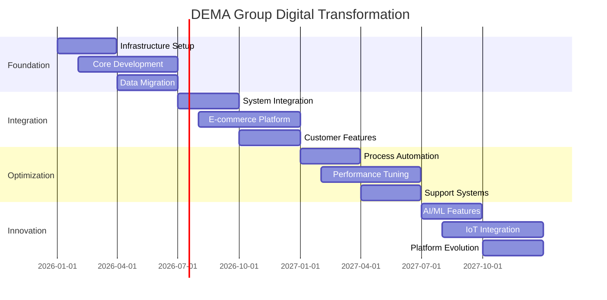

# DEMA Group Digital Transformation - Master Document

## Project Overview
- **Project Name**: DEMA Group Digital Transformation
- **Start Date**: January 2026
- **Target Completion**: December 2027
- **Total Budget**: €2.6M
- **Current Phase**: Foundation (Phase 1)

## Table of Contents
1. [Executive Summary](#executive-summary)
2. [Technical Architecture](#technical-architecture)
3. [Implementation Progress](#implementation-progress)
4. [Financial Status](#financial-status)
5. [Risk Management](#risk-management)
6. [Quality Metrics](#quality-metrics)

## Executive Summary
${include("docs/strategic-analysis/01-executive-summary.md")}

## Technical Architecture
${include("docs/07-technical-specs/architecture-details.md")}

## Implementation Progress
${include("docs/strategic-analysis/02-technical-roadmap.md")}

## Financial Status
${include("docs/06-financial-projections/financial-model.md")}

## Risk Management
${include("docs/06-financial-projections/risk-matrix.md")}

## Quality Metrics
${include("docs/07-technical-specs/implementation-guide.md")}

## Project Timeline

## Current Status

### Implementation Progress
| Component | Status | Progress | Due Date |
|-----------|--------|----------|-----------|
${status_table}

### Financial Overview
| Metric | Target | Current | Variance |
|--------|---------|----------|-----------|
${financial_metrics}

### Risk Summary
| Category | High | Medium | Low |
|----------|------|--------|-----|
${risk_summary}

## Recent Updates
${recent_updates}

---
*Last Updated: ${current_date}*
*Generated by: Project Documentation System*
