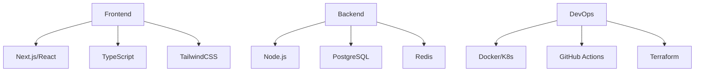

# Group Strategy: Unified Industrial Platform

## Vision
Transform 5 specialized Belgian industrial companies into a unified "all-in-one" B2B platform, following the Kramp/Sodeco model of comprehensive industrial supply.

## Companies in Scope

| Company | Specialization | Website |
|---------|---------------|---------|
| **DEMA** | Pumps, pipes, fittings, tools, irrigation | demashop.be |
| **Fluxer** | Valves, process instrumentation, flow control | fluxer.be |
| **Beltz247** | Conveyor belts, mechanical maintenance | beltz247.com |
| **De Visschere Technics** | Irrigation systems, garden technology | devisscheretechnics.be |
| **Accu Components** | Precision engineering components | accu-components.com |

## Benchmark Platforms (Eagle Approach)

| Platform | Model | Key Features |
|----------|-------|--------------|
| **Kramp** | Europe's largest agri-parts supplier | 500K+ products, dealer network, B2B portal, configurators |
| **Sodeco Valves** | Industrial valve specialist | €6M stock, European distribution, technical expertise |

## Folder Structure

```
group-strategy/
├── README.md                          # This file
├── 01-executive-summary/
│   └── executive-summary.md           # High-level strategy overview
├── 02-company-analysis/
│   ├── company-profiles.md            # Individual company profiles
│   ├── swot-analysis.md               # SWOT for each company
│   └── synergy-matrix.md              # Cross-company synergies
├── 03-market-analysis/
│   ├── benchmark-analysis.md          # Kramp & Sodeco analysis
│   ├── competitive-landscape.md       # Market positioning
│   └── target-segments.md             # Customer segments
├── 04-integration-strategy/
│   ├── integration-roadmap.md         # Phased integration plan
│   ├── technical-architecture.md      # Platform architecture
│   ├── data-integration.md            # Product data unification
│   └── brand-strategy.md              # Unified vs multi-brand
├── 05-action-plans/
│   ├── phase1-foundation.md           # 0-6 months
│   ├── phase2-integration.md          # 6-18 months
│   ├── phase3-expansion.md            # 18-36 months
│   └── kpi-dashboard.md               # Success metrics
├── 06-financial-projections/
│   ├── investment-requirements.md     # CapEx/OpEx
│   ├── roi-analysis.md                # Return projections
│   └── risk-assessment.md             # Risk mitigation
├── 07-technical-specs/
│   ├── platform-requirements.md       # Technical requirements
│   ├── api-integration.md             # System integration
│   └── dema-webshop-demo.md           # Link to existing demo
└── 08-appendices/
    ├── glossary.md                    # Industry terms
    └── references.md                  # Sources and links
```

## Strategic Analysis

### Executive Summary

The DEMA Group digital transformation aims to unify five specialized companies under a single digital platform:
- **DEMA**: Industrial pumps and equipment
- **Fluxer**: Process flow and valve technology
- **Beltz247**: Conveyor systems and maintenance
- **De Visschere**: Irrigation systems
- **Accu**: Precision components

**Key Metrics:**
- Investment: €2.6M
- Expected ROI: 2.5 years
- Revenue Growth: +15% YoY
- Cost Reduction: -20% OpEx
- Market Share: +5% in key segments

[Full Executive Summary](strategic-analysis/01-executive-summary.md)

### Technical Roadmap

**Phase 1: Foundation (Months 1-6)**
- Infrastructure Setup ⏳
- Core Platform Development 🚧
- Data Migration 📊
- Security Implementation 🔒

**Phase 2: Integration (Months 6-12)**
- Company Systems Integration
- E-commerce Features
- Customer Features
- Analytics Implementation

**Phase 3: Optimization (Months 12-18)**
- Process Automation
- Advanced Features
- Performance Optimization
- Support Systems

**Phase 4: Innovation (Months 18-24)**
- AI/ML Implementation
- IoT Integration
- Advanced Analytics
- Platform Evolution

[Full Technical Roadmap](strategic-analysis/02-technical-roadmap.md)

### Technology Stack



### Integration Strategy

**Core Principles:**
1. Microservices Architecture
2. API-First Development
3. Event-Driven Design
4. Security by Design
5. Cloud-Native Infrastructure

**Key Integrations:**
- ERP Systems
- CRM Platforms
- Inventory Management
- Payment Processors
- Analytics Tools

[Full Integration Strategy](04-integration-strategy/integration-roadmap.md)

### Action Plans

**Immediate Actions (0-6 months):**
- [x] Cloud Infrastructure Setup
- [x] Development Environment
- [x] CI/CD Pipeline
- [ ] Core Platform Development
- [ ] Initial Data Migration

**Short Term (6-12 months):**
- [ ] Company System Integration
- [ ] E-commerce Platform
- [ ] Customer Features
- [ ] Analytics Dashboard
- [ ] Support Systems

**Medium Term (12-18 months):**
- [ ] Process Automation
- [ ] Advanced Features
- [ ] Performance Optimization
- [ ] ML/AI Implementation
- [ ] IoT Integration

[Full Action Plan](05-action-plans/phase1-foundation.md)

### Project Status

| Milestone | Progress | Due Date |
|-----------|----------|-----------|
| Infrastructure | 75% | Q1 2026 |
| Core Platform | 60% | Q2 2026 |
| Integration | 40% | Q3 2026 |
| Optimization | 20% | Q4 2026 |
| Innovation | 10% | Q1 2027 |

## Quick Links

- [Executive Summary](01-executive-summary/executive-summary.md)
- [Integration Roadmap](04-integration-strategy/integration-roadmap.md)
- [Action Plans](05-action-plans/)
- [DEMA Webshop Demo](../dema-webshop/) - Working prototype

## Daily Progress Updates

- [Project Progress Log](PROJECT_PROGRESS.md)

## Project Status

| Document | Status |
|----------|--------|
| Executive Summary | ✅ Complete |
| Company Profiles | ✅ Complete |
| SWOT Analysis | ✅ Complete |
| Integration Strategy | ✅ Complete |
| Action Plans | ✅ Complete |
| Financial Projections | ✅ Complete |
| Technical Architecture | ✅ Complete |

---
*Last Updated: December 2024*
