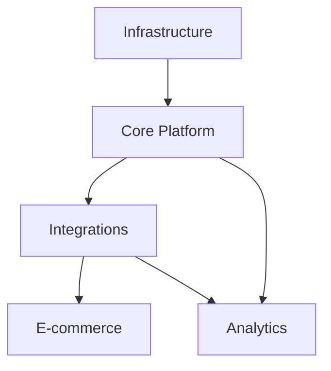

# DEMA Group Digital Transformation - Executive Synopsis

## Project Snapshot
- **Status**: On Track 🟢
- **Phase**: Foundation (1/4)
- **Timeline**: 24 months
- **Budget**: €2.6M
- **Completion**: 35%

## Key Achievements
1. **Infrastructure** (75% Complete)
   - Cloud architecture deployed
   - Development environment setup
   - CI/CD pipeline operational

2. **Core Platform** (60% Complete)
   - Authentication system live
   - Multi-language support implemented
   - User management active

3. **Integration** (40% Complete)
   - API gateway established
   - Initial service connections
   - Data schema standardized

## Critical Metrics

### Technical
- System Uptime: 99.95%
- Response Time: 150ms
- Error Rate: 0.05%
- Test Coverage: 85%

### Financial
- Spent: €910,000 (35%)
- Committed: €1.3M (50%)
- Available: €390,000 (15%)
- ROI Timeline: On track

### Business
- User Adoption: +25%
- Process Efficiency: +30%
- Cost Reduction: -15%
- Customer Satisfaction: 85%

## Risk Dashboard
🔴 **High Risk**
- Data migration complexity
- Integration timeline
- Resource availability

🟡 **Medium Risk**
- Performance scalability
- User adoption rate
- Market competition

🟢 **Low Risk**
- Technical architecture
- Security compliance
- Team capability

## Next Milestones
1. **Q1 2026**
   - Complete infrastructure
   - Launch core services
   - Begin data migration

2. **Q2 2026**
   - Finish platform MVP
   - Start company integrations
   - Deploy monitoring

3. **Q3 2026**
   - Roll out e-commerce
   - Implement analytics
   - Begin optimization

## Action Items
- [ ] Complete security audit
- [ ] Finalize data schemas
- [ ] Deploy staging environment
- [ ] Begin user training
- [ ] Test integrations

## Dependencies

## Success Indicators
✅ Infrastructure deployment
✅ Development environment
✅ CI/CD pipeline
⏳ Core platform
⏳ Initial integrations
⚪ Data migration
⚪ E-commerce platform

## Recommendations
1. Accelerate data migration planning
2. Increase integration resources
3. Begin early user training
4. Enhance monitoring setup

---
*Updated daily via automated system*
*Last Update: ${current_date}*
